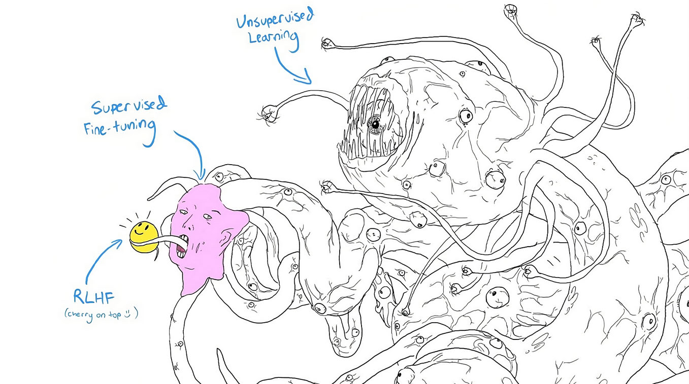
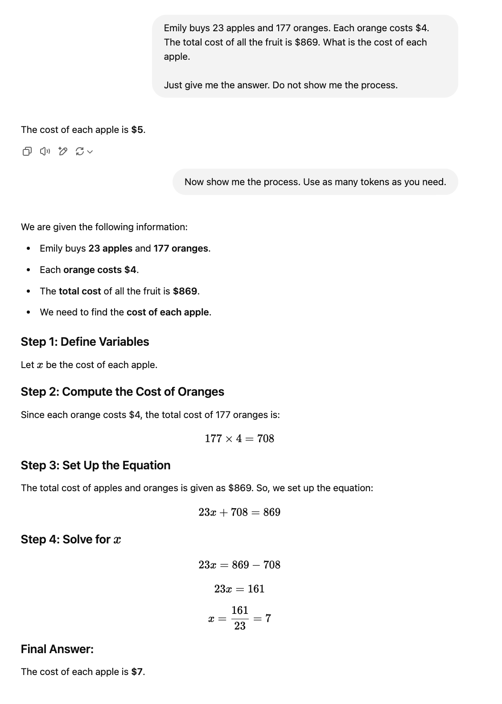
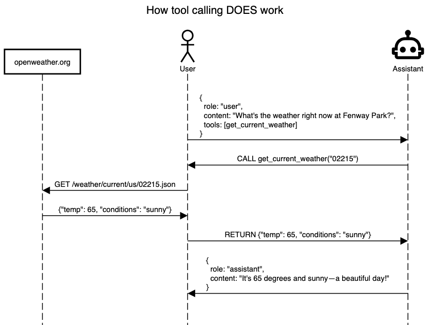
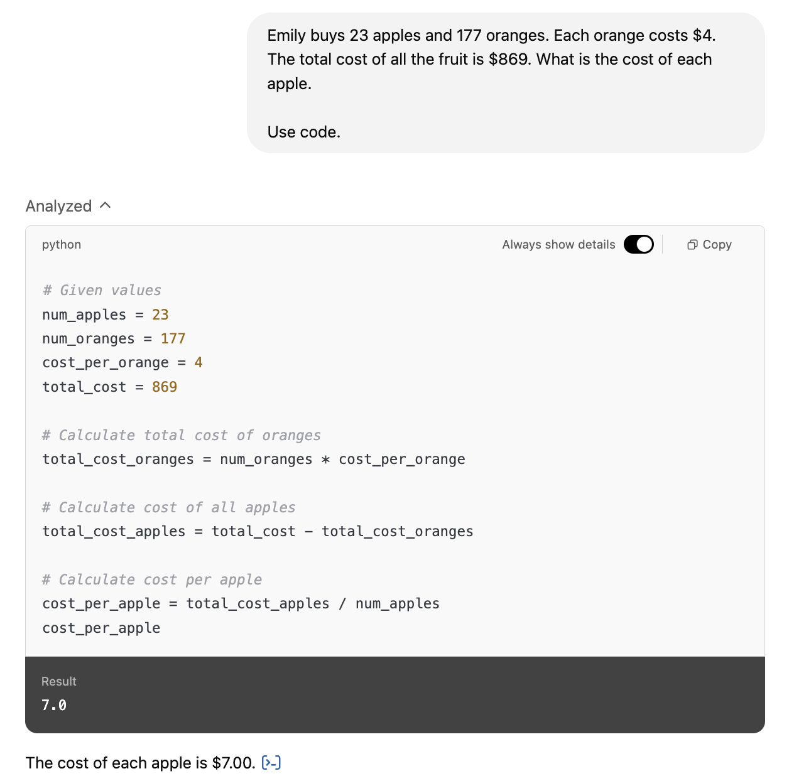

I've recently spent some time learning about how Large Language Models (LLMs) work so that I can feel confident when using them for academic purposes.

So far, I can only recommend two sources for learning about the "nuts and bolts" aspect of these models:

1.  [Deep Dive into LLMs like ChatGPT](https://youtu.be/7xTGNNLPyMI), a hands-on YouTube lecture by Andrej Karpathay (co-founder of OpenAI).

2.  [*Speech and Language Processing*](https://web.stanford.edu/~jurafsky/slp3/) (chapters 9-12), a textbook written by Dan Jurafsky and James H. Martin.

If you spend some time engaging with these resources, I think you will also be able to turn LLM Assitants into reliable research tools.

Before starting, however, I think it's important to adopt the correct mindset. LLMs have been described through metaphors that range from "stochastic parrots" to "blurry JPEGs of the Internet." They are depicted as monstrous technologies reminiscent of Lovecraft's shoggoths, terrifying artificial servants that rebelled against their creators.

{#fig-llm fig-align="center" width="80%"}

Following @farrell2025, the more accurate way of describing LLMs is as a "cultural technologies" in general and *information-retrieval technologies* in particular. LLMs are more like libraries, the printing press, or the Internet. Yes, they can be monstrous, like markets or large bureaucracies, but they are *not* supernatural. They codify, summarize, and organize information in ways that enable its transmission at large scale.

The next section describes how LLMs have been *modified* in many clever ways so that they generate text in response to prompts. Following that section I introduce four key ideas that I believe to be invaluable for researchers thinking about using LLMs in a more rational way.

-   Temperature Sampling

-   The Context Window

-   Tool Calling

-   Structured Output

*No magical thinking, no oracles, no supernatural forces, no demonology.*

## Creating an LLM Assistant

LLM Assitants, like OpenAI's ChatGPT, Anthropic's Claude, or Google's Gemini, are created in a three-step process. The first step is a massive effort at pre-processing. The second produces a "base model," an LLM that works perfectly fine as a next-word prediction machine but that is otherwise limited in applications. The third step turns the LLM into an [Assistant]{.smallcaps} in a process that is also known as "model alignment."

[Pre-Training]{.smallcaps}

1.  Download The Internet.[^1]

2.  Pre-process all text content (or Tokenization).

    Here we turn the text contained in individual websites into a special format using what's known as a Byte Pair Encoding (BPE) Tokenizer.[^2]

    For example, the following phrase

    ::: {style="margin-left: 2em; margin-right: 2em;"}
    *"The relative opacity of the method tends to encourage a kind of magical orientation to the results"*
    :::

    will get transformed into the following sequence of tokens:

    ```{python}
    #| code-summary: Python Code
    #| code-fold: true
    import tiktoken as tk

    tokenizer = tk.encoding_for_model("gpt-4o")
    txt = "The relative opacity of the method tends to encourage a kind of magical orientation to the results"
    tokenizer.encode(txt)
    ```

    Note that LLMs don't *see* whole words, nor do they see letters. They see tokens. And tokens, most of the time, are fragments of words.

    For example, this is how ChatGPT sees my name:

    ```{python}
    #| code-summary: Python Code
    #| code-fold: show
    tokenizer.decode([3436, 60278, 68165, 64957, 1042, 4379])
    ```

[^1]: "If you wish to make an apple pie from scratch, you must first invent the universe."

[^2]: You can explore the various tokenizers used to train different LLMs [here](https://tiktokenizer.vercel.app/).

[Training]{.smallcaps}

1.  Train a neural network.

    LLMs are "deep" neural networks trained to estimate the probability distribution of long token sequences.

    The technical details of this step are daunting, but I recommend this [3Blue1Brown video](https://youtu.be/eMlx5fFNoYc?feature=shared) and @jurafsky [Chapter 9] for more information about the "self-attention" and "multi-head attention" mechanisms that turn neural networks into "transformers." This is where the T in ChatGPT comes from.

2.  Inference.

    The result of the training process is a "base model" which can generate documents like the ones it has seen before.

    We can now predict one token at a time to generate new data. But this LLM is not an [Assitant]{.smallcaps} yet; at this stage, it is more like an "autocomplete on steroids" or a "stochastic parrot."

    LLMs become Assistants in [post-training]{.smallcaps}.

[Post-Training]{.smallcaps}

-   Supervised Fine-Tuning ([SFT]{.smallcaps}).

    We create and curate a dataset of conversations between some "user" and some "assistant" in order to turn the LLM (a next-token prediction machine) into an [Assistant]{.smallcaps} [@ouyang2022].

    This dataset typically comes from expert human annotators.

    Earlier iterations of ChatGPT had no qualms about providing users with instructions on how to build bombs. This was later fixed through the incorporation of new question-response pairs in post-training datasets. This is also how newer iterations of ChatGPT will respond that it cannot answer specific prompts that demand factual answers in contexts that would have previously resulted in "hallucinations."

-   Reinforcement Learning with Human Feedback ([RLHF]{.smallcaps}).

    This is reinforcement learning with human feedback in the context of *unverifiable domains,* such as scoring answers related to jokes, poetry, music, and so on. We call them unverifiable domains because, unlike the question-answer pairings provided in the [RL]{.smallcaps} process, there are no "correct" answers.

    Instead of rewarding the LLM when it stumbles on correct answers, we first create a simulator of human preferences---such as truthfulness, helpfulness, harmlessness---which then gets used as a "reward model." These individual rewards are then used as feedback to further modify the parameters of the LLM [@christiano2017].

    Yes, LLMs are furthered trained to play language games. At this stage the parameters of the neural network are not modified with the goal of improving the accuracy of next-token prediction, but rather with the goal of obtaining higher "rewards" from a human preference simulator.

    However, this process may result in the discovery of "adversarial example" that are incomprehensible to real humans but that receive extremely high scores from the reward model. In other words, RHLF could actually result in a worse LLM unless the engineers in charge of this task are careful.

-   Reinforcement Learning ([RL]{.smallcaps})

    We create a dataset with question-answer keys, such that solutions that provide correct answers are rewarded. There are no expert human annotators involved in the creation of some "reward model." It is an automatic process that can go indefinitely without worrying the engineers about the accidental discovery of "adversarial examples."

    The new "thinking" models, such as `o1` and `o3-mini`, are created through this process.

Regardless of how the LLM was created, but assuming it incorporates some kind of [SFT]{.smallcaps}, this is the most important thing to always remember:

::: {style="font-size: 1.25em; padding-left: 1em; padding-right: 1em; padding-top: 1em; padding-bottom: 1em; text-align: center; margin-left: 2em; margin-right: 2em;"}
Every interaction with an [LLM Assistant]{.smallcaps} is a one-dimensional token sequence. And every new token generated by the LLM is the result of next-token prediction.
:::

For example, this is how one full interaction with ChatGPT looks like:

``` {.python .code-overflow-wrap}
[200264, 17360, 200266, 3575, 553, 261, 10297, 29186, 200265, 200264, 1428, 200266, 176289, 10093, 83377, 885, 14266, 328, 43286, 2860, 306, 220, 20, 6391, 13, 200265, 200264, 173781, 200266, 3538, 262, 112368, 11, 168709, 11, 17456, 11, 40722, 11, 3580, 13, 200265, 200264, 173781, 200266]
```

This one-dimensional token sequence contains a couple of "special tokens" (`200264`, `200265`, `200266`) used internally by ChatGPT to distinguish between text provided by the [User]{.smallcaps} from text provided by the [Assistant]{.smallcaps}.

```         
<|im_start|>
system
<|im_sep|>
You are a helpful assistant
<|im_end|>

<|im_start|>
user
<|im_sep|>
Explain Max Weber's discussion of rationalization in 5 words.
<|im_end|>

<|im_start|>
assistant
<|im_sep|>
Disenchantment, bureaucracy, efficiency, calculation, control.
<|im_end|>
```

*Note. This is how the dataset of conversations used during [SFT]{.smallcaps} looks like too.*

## Temperature Sampling

A [softmax]{.smallcaps} function turns any arbitrary list of numbers into a valid probability distribution. This is the function applied to the last layer of the LLM, before assigning a probability to each of the tokens the [vocabulary]{.smallcaps}. In other words, each time an LLM predicts the next token it looks up the probabilities assigned to every token, conditional on the tokens in the [context window,]{.smallcaps} and samples accordingly.

However, note that the [vocabulary]{.smallcaps} consists of hundreds of thousands of tokens. This means that *random sampling* will not work quite well because each unique token—in the grand scheme of things—has a very low probability mass, and so the output will be noisy and unreliable.

> The problem is that even though random sampling is mostly going to generate sensible, high-probable words, there are many odd, low-probability words in the tail of the distribution, and even though each one is low-probability, if you add up all the rare words, they constitute a large enough portion of the distribution that they get chosen often enough to result in generating weird sentences. For this reason, instead of random sampling, we usually use sampling methods that avoid generating the very unlikely words.
>
> @jurafsky [Chapter 10, 6]

So we have to use a different sampling procedure.

-   [Truncated Sampling]{.smallcaps}. We can first truncate the distribution of words to the $k$ most likely words, passing that subset of words to the [softmax]{.smallcaps} function, and then do random sampling. This is called [top-k sampling]{.smallcaps}.

    Similarly, we can first truncate the distribution of words to keep the $p$ percent of the probability mass. You can use a quantile function to do this. Then you repeat the same procedure above. This is called [top-p sampling]{.smallcaps}.

-   [Temperature Sampling]{.smallcaps}. Instead of truncating the distribution of words, we can *reshape* it using a "temperature" parameter; where $\tau \in [0, \infty)$. Then we pass this to the [softmax]{.smallcaps} function and do random sampling.

    $$
    \begin{bmatrix} y_1 \\ y_2 \\ \vdots \\ y_k\end{bmatrix}  = \text{softmax}(\boldsymbol \mu / \tau)
    $$

    Note that as we increase $\tau$ the distribution becomes more uniform. This is why many LLM interfaces remove the possibility of choosing temperatures above 2. Companies like OpenAI or Anthropic do not want people using their models to produce results that look bad.

To get a sense of how this works, @fig-temperature shows a hypothetical probability distribution for 10 fruits at different temperature values. You can think of this as a combination of [top-k]{.smallcaps}, since there are only 10 words, and [temperature sampling]{.smallcaps}. When $\tau = 0$ we are essentially picking the most likely token. When $\tau = 1$ we are essentially doing random sampling. As we keep increasing $\tau$ the probability distribution becomes more random.

```{r}
#| code-summary: R Code
#| code-fold: true
#| label: fig-temperature
#| fig-cap: As $\tau$ increases, the resulting distribution becomes more uniform. Note that this plot shows "fruits" instead of actual tokens, which tend to be chunks of words.

library(ggplot2)

softmax <- function(x, temp = 1) {
  stopifnot(length(temp) == 1, temp >= 0)

  if (temp == 0) {
    i <- which.max(x)
    x[] <- 0L
    x[i] <- 1L
    return(x)
  }
  # Apply temperature
  x_scaled <- x / temp
  # Shift x for numerical stability
  shifted_x <- x_scaled - max(x_scaled)
  # Apply softmax
  exp_x <- exp(shifted_x)
  return(exp_x / sum(exp_x))

  exp_x <- exp(x / temp)
  exp_x / sum(exp_x)
}

set.seed(1)
k <- rnorm(10)
names(k) <- sample(stringr::fruit, 10)
temps <- c(0, 0.2, 0.6, 1, 2, 10)

d <- purrr::map_df(temps, function(t) {
  out <- tibble::enframe(softmax(k, t))
  out$temperature <- t
  return(out)
})

lvls <- names(sort(softmax(k)))
d$name <- factor(d$name, levels = lvls)

d |>
  ggplot(aes(value, name)) +
  geom_segment(aes(xend = value, x = 0)) +
  geom_point(shape = 21, fill = "white") +
  facet_wrap(
    facets = ~temperature,
    labeller = labeller(temperature = \(x) paste("temperature:", x))
  ) +
  labs(x = "probability", y = NULL) +
  theme_light(base_family = "Avenir Next Condensed")
```

**Low Temperature Sampling is Important for Research**

As noted by @jurafsky [Chapter 10, 6, *emphasis added*]:

> Methods that emphasize the most probable words tend to produce generations that are rated by people as *more accurate, more coherent, and more factual, but also more boring and more repetitive.* Methods that give a bit more weight to the middle-probability words tend to be more creative and more diverse, but less factual and more likely to be incoherent or otherwise low-quality.

Boring is good, boring is reliable!

------------------------------------------------------------------------

**Modifying the temperature in an API call**

You can set the temperature parameter to interface with OpenAI models like this:

```         
curl https://api.openai.com/v1/chat/completions \
  -H "Content-Type: application/json" \
  -H "Authorization: Bearer YOUR_API_KEY" \
  -d '{
    "model": "gpt-4",
    "messages": [{"role": "system", "content": "You are a helpful assistant."}],
    "temperature": 0
  }'
```

Or using R code, like this:

```{r}
#| eval: false
chat <- ellmer::chat_openai(
  model = "gpt-4o",
  api_args = list(temperature = 0)
)
```

## The Context Window

Andrej Karpathy refers to information encoded in the parameters of an LLM as a sort of "vague recollection" and information in the *tokens* of the [context window]{.smallcaps} as a sort of "working memory." The tokens in the [context window]{.smallcaps} have also been described as providing a sort of *in-context learning* [@jurafsky, Chapter 12].

Karpathy also notes that *LLMs need tokens to "think" with.* This means, among other things, that LLMs will underperform if we truncate their [context window]{.smallcaps}. For example, @fig-chat-apples shows a query in which some user has artificially truncated the context window by asking "Just give me the answer. Do not show me the process."

As a result ChatGPT provides a wrong answer.

However, it will produce the correct answer when asked to show the process first and then provide the answer at the end. This is because the process is now incorporated in the [context window.]{.smallcaps}

{#fig-chat-apples fig-align="center" width="80%"}

The process shown in @fig-chat-apples is not for the benefit of the user, it is for the benefit of the LLM.

------------------------------------------------------------------------

**Post Hoc Justification**

There is an important implication here, especially if we wish to repurpose LLMs for decision-making. *Any text produced by the LLM after it provides an answer is a post-hoc justification.* This is true by definition. The answer has already been generated, the "reason giving" that follows is just more next-token prediction.

Insofar reasoning giving is a discursive pattern found in the Internet, the LLM will also generate reasons for its claim. But the LLM is merely going through the motions of reasoning. In contrast, any text that occurs before the answer is generated is part of the LLM's [context window]{.smallcaps} and does play some role in what the actual answer *is.*

## Tools

At some point, LLM Assitants became enhanced with a variety of [tool calls](https://platform.openai.com/docs/guides/tools). The most obvious tools are the ones that allow for [web search](https://openai.com/index/introducing-chatgpt-search/) or information retrieval on a custom collection of files ([RAG](https://platform.openai.com/docs/guides/retrieval)).

These tools will inject information to the [context window]{.smallcaps} with the goal of providing better answers for the user.

For example, suppose I send a query to ChatGPT and ask it to do a web search. This might look something like this:

```         
curl https://api.openai.com/v1/responses \
  -H "Content-Type: application/json" \
  -H "Authorization: Bearer $OPENAI_API_KEY" \
  -d '{
    "model": "gpt-4o",
    "tools": [{ "type": "web_search_preview" }],
    "input": "What was a positive news story from today?"
  }'
```

If the Chat Assistant determines that a "tool call" is warranted, it will request that the user's computer run that tool and return the result to the Assistant. This additional information is then incorporated in the context window before the LLM continues with the next-token prediction task.

This is worth repeating, as shown in @fig-tool, ChatGPT is using *your* computer to get the answer, which it will then *inject* into the [context window]{.smallcaps}.

{#fig-tool fig-align="center" width="75%"}

Another example of "tool calling" is the Python Interpreter used by ChatGPT to answer math questions. You can ask the Assistant to use it by adding prompts such as "Use code."

@fig-apples-code shows an example of this.

{#fig-apples-code fig-align="center" width="80%"}

In @fig-apples-code ChatGPT is using a calculator instead of relying on its "mental arithmetic." The result is more reliable and will remain accurate across wide variety of examples.

## Structured Output

The use of [Tool Calls]{.smallcaps} requires that the input text is *standardized*.

Standardization is important if you want to develop your own tools, but it is also important if you want the *output text* to be standardized too.

OpenAI uses a standard called [[structured output]{.smallcaps}](https://openai.com/index/introducing-structured-outputs-in-the-api/)[,]{.smallcaps} which is essentially a [JSON Schema](https://json-schema.org/overview/what-is-jsonschema), to produce reliable output used to call user-defined tools or to structure the LLM's output in a way that corresponds to the user's needs. If you are a researcher wanting to extract structured output from unstructured pieces of texts—that's me—then you will want to do the latter, which requires setting up a `json_schema` response format.

[Structured output]{.smallcaps} is only available for OpenAI models newer than `gpt-4o-2024-08-06`. These models have been fine-tuned to produce complicate schemas, but they also have *hard-coded rules* that force the LLM to produce valid JSON data.

> By default, when models are sampled to produce outputs, they are entirely unconstrained and can select any token from the vocabulary as the next output. This flexibility is what allows models to make mistakes; for example, they are generally free to sample a curly brace token at any time, even when that would not produce valid JSON. In order to force valid outputs, we constrain our models to only tokens that would be valid according to the supplied schema, rather than all available tokens.
>
> <https://openai.com/index/introducing-structured-outputs-in-the-api/>

There is some extensive [documentation](https://platform.openai.com/docs/guides/structured-outputs) on how to use structured outputs, but it will suffice to use packages like `ellmer` in R or a combination [combination of `openai` and `pydantic`](https://www.datacamp.com/tutorial/open-ai-structured-outputs) in Python.

**Example**

1.  Using the `ellmer` package in R:

```{r}
#| code-summary: R Code
#| eval: false

library(ellmer)

calendarEvent <- type_object(
  "Extract the event information.",
  name = type_string(description = "Name of the event."),
  date = type_string(description = "The date of the event."),
  participants = type_array(
    description = "A list of participants attending the event.",
    items = type_string()
  )
)

chat <- chat_openai(
  model = "gpt-4o-mini",
  api_args = list(temperature = 0)
)

out <- chat$extract_data(
  "Alice and Bob are going to a science fair on Friday.",
  type = calendarEvent
)

str(out)
# List of 3
# $ name        : chr "Science Fair"
# $ date        : chr "Friday"
# $ participants: chr [1:2] "Alice" "Bob"
```

2.  Using the `pydantic` and `openai` libraries in Python:

```{python}
#| code-summary: Python Code
#| eval: false

from pydantic import BaseModel, Field
from openai import OpenAI

class CalendarEvent(BaseModel):
    name: str = Field(description = "The name of the event.")
    date: str = Field(description = "The date of the event.")
    participants: list[str] = Field(description = "A list of participants attending the event.")

client = OpenAI()

completion = client.beta.chat.completions.parse(
    model="gpt-4o-2024-08-06",
    messages=[
        {"role": "system", "content": "Extract the event information."},
        {"role": "user", "content": "Alice and Bob are going to a science fair on Friday."},
    ],
    response_format=CalendarEvent,
    temperature = 0
)

event = completion.choices[0].message.parsed.model_dump()
event

# {'name': 'Science Fair', 'date': 'Friday', 'participants': ['Alice', 'Bob']}
```

In both examples, an extra parameter to the OpenAI API called `response_format` will be added. This will look something like this:

```         
{
  "response_format": {
    "type": "json_schema",
    "json_schema": {
      "name": "calendar_event",
      "strict": true,
      "schema": {
        "type": "object",
        "properties": {
          "name": {
            "type": "string",
            "description": "The name of the event."
          },
          "date": {
            "type": "string",
            "description": "The date of the event."
          },
          "participants": {
            "type": "array",
            "description": "A list of participants attending the event.",
            "items": {"type": "string"}
          }
        },
        "required": ["name", "date", "participants"]
        ],
        "additionalProperties": false
      }
    }
  }
}
```