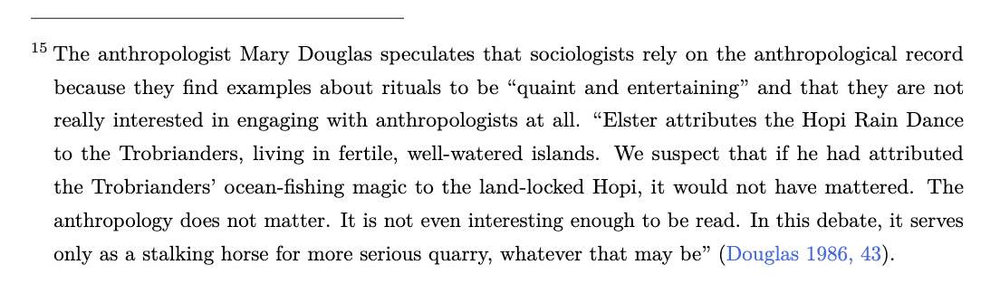
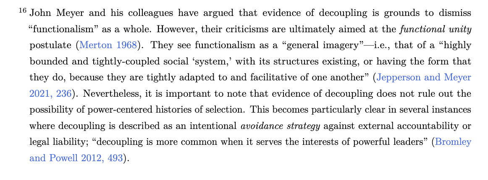

-   The term “Cargo Cult Science” was popularized in the 1970s by physicist Richard Feynamn in an effort to describe behaviors that look scientific in "form" but not in "substance."

-   This metaphor has been used to describe all sorts of things, such as some elements of computer programming,[^1] statistics,[^2] and all the social sciences.

-   Imitation without understanding. Importantly, it refers to *unsuccessful* ritualistic practices.

[^1]: From the [Jargon File](http://www.catb.org/~esr/jargon/html/C/cargo-cult-programming.html): «**cargo cult programming: n.** A style of (incompetent) programming dominated by ritual inclusion of code or program structures that serve no real purpose. A cargo cult programmer will usually explain the extra code as a way of working around some bug encountered in the past, but usually neither the bug nor the reason the code apparently avoided the bug was ever fully understood (compare [shotgun debugging](http://www.catb.org/~esr/jargon/html/S/shotgun-debugging.html), [voodoo programming](http://www.catb.org/~esr/jargon/html/V/voodoo-programming.html)).»

[^2]: From the [Significance Magazine](https://significancemagazine.com/cargo-cult-statistics-and-scientific-crisis/): «In our experience, many applications of statistics are cargo-cult statistics: practitioners go through the motions of fitting models, computing *p*-values or confidence intervals, or simulating posterior distributions. They invoke statistical terms and procedures as incantations, with scant understanding of the assumptions or relevance of the calculations, or even the meaning of the terminology. This demotes statistics from a way of thinking about evidence and avoiding self-deception to a formal “blessing” of claims.»

> \[Feynman\] presented a simplified view of a cargo cult in the “South Seas” where the people saw airplanes deliver materials during the war and wanted the same thing to happen again. “So they’ve arranged to make things like runways... to make a wooden hut for a man to sit in, with two wooden pieces on his head like headphones and bars of bamboo sticking out like antennas he’s the controller—and they wait for the airplanes to land... The form is perfect. It looks exactly the way it looked before. But it doesn’t work. No airplanes land. So I call these things Cargo Cult Science, because they follow all the apparent precepts and forms of scientific investigation, but they’re missing something essential, because the planes don’t land.”
>
> @gelman2025 [2]

@gelman2025 go on to note that this metaphor is problematic for two reasons.

-   It has a connotation of historical "backwardness" that is hard to square with the idea that we are accusing the most educated people in the world of engaging in these practices. Perhaps it has a rhetorical flair, but it is just a cheap shot. It is amusing to think about entire teams of PhDs in fancy research universities and portray them as members of "unsophisticated" cultures.

-   Feynman says that what's missing in the cargo cult picture is the lack of "integrity", by which he means integrity among the scientists who take up the "form" of science at the expense of its "substance." But then the metaphor has traveled.

> Setting aside questions of historical accuracy, the members of Feynman’s cargo cult lacked access to various aspects of modern science and technology, but there is no reason to believe they were being dishonest or lacking integrity within their own cultures.

...

> An example of such a ritualistic application is researchers copying the superficial trappings of a statistical procedure... without implementing, or even understanding, the fundamental assumptions on which the validity of the procedure is predicated—or worse, without even asking what is needed for the method to be valid and reliable enough to use in practice.