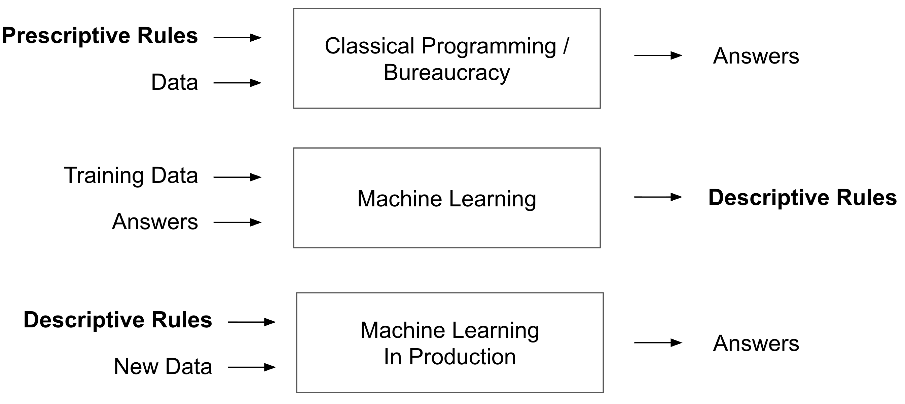

Machine Learning algorithms take data-as-*inputs* and produce rules-as-*outputs*. This what distinguishes them from "classical programming," where human experts create a set of rules-as-*inputs* that are then used to automate decision-making across a variety of tasks.

François @chollet2021 [4] describes this change of paradigm as follows:

> "The usual way to make a computer do useful work is to have a human programmer write down *rules*—a computer program—to be followed to turn input data into appropriate answers... Machine learning turns this around: the machine looks at the input data and the corresponding answers, and figures out what the rules should be (see @fig-chollet). A machine learning system is *trained* rather than explicitly programmed. It’s presented with many examples relevant to a task, and it finds statistical structure in these examples that eventually allows the system to come up with rules for automating the task."

![Machine learning: a new programming paradigm [@chollet2021, 4]](images/chollet.png){#fig-chollet fig-align="center" width="60%"}

The purpose of this blog post is to note that this widely held view glosses over the basic distinction between *prescriptive rules* and *descriptive* *rules.* The former are meant to prevent, modify, or reinforce behavior; the latter are meant to state empirical regularities.

::: {style="padding-left:2em;"}
**Prescriptive Rules:** "Speed limit 55." "No smoking." "Authors must submit replication packages before publication." "Thou shalt not kill."

**Descriptive Rules:** "Water boils at 100°C." "Law of Gravity." "Voter turnout declines with income."
:::

So, what kinds of rules are depicted in @fig-chollet?

The answer is given in @fig-ai: machine learning algorithms can *only* produce descriptive rules. Things get more interesting if we accept the validity of "[Hume's Law](https://en.wikipedia.org/wiki/Is%E2%80%93ought_problem),"[^1] which states that we cannot derive normative conclusions exclusively from descriptive premises: machine learning algorithms cannot, by themselves, produce prescriptive rules.

[^1]: prescriptive

Prescriptive rules are intentionally *created* with the purpose of guiding behavior. We obey them when they are *legitimate*—or under threat of sanction. In contrast, we rely on descriptive rules when they are *accurate*. But these two things are not the same thing. And there is no reason for us to conflate them.

{#fig-ai fig-align="center" width="90%"}