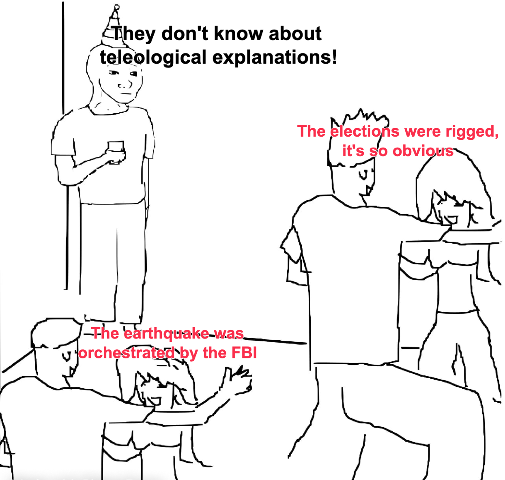

I spent the last couple of months visiting and talking to old friends and family. However, I did not expect to find myself surrounded by so many conspiracy theories.

{fig-align="center" width="75%"}

Thinking about it some more I realized I was uncomfortable with my understanding of the concept of conspiracy theories, so in this entry I try to provide a definition of my own.

In short, conspiracy theories are characterized by two mutually supporting features. First, all conspiracy theories are a species of *teleological explanation.* Second, all conspiracy theories are supported by a social structure of like-minded individuals that remain *isolated* from disconfirming evidence.

The final section will argue that most plausible explanations for *why* people engage in conspiracy theories are themselves teleological explanations.

### Teleology

A teleological explanation seeks to explain the presence, shape, or behavior of some phenomena by making reference to its *purpose* [@ruse2017; @tugby2024]. This is a style of explanation that goes all the way back to Aristotle's discussion of *final causes* [@leunissen2010].[^1]

[^1]: The best way to make a good teleological explanation is to (1) replace the word "purpose" with either *function* or *goal;* and (2) try to be more careful about the evidence required to support the actual argument your are trying to make. **Do not assume that all teleological explanations are bad explanations** [@castro2025].

Conspiracy theories are a species of teleological explanation. Typically, they explain some phenomena by making reference to a secret plot orchestrated by some powerful and malevolent group [@douglas2017].

The problem with this kind of explanation is not that it is necessarily wrong, but rather that it is very easy to fabricate and very hard to disprove. First, it is easy to imagine a million ways in which some phenomena is "beneficial" (whatever that means) to at least some subset of the population. Second, it is also easy to speculate that these "beneficiaries" may be following some hidden agenda or that they are being directed towards a “goal” that they rather keep secret. Third, it is easy to convince yourself that, since *nothing happens by accident*, the reason you are endorsing a conspiracy theory is because you are a critical thinker.[^2]

[^2]: According to Peter Berger [-@berger1963, 23], the "the first wisdom of sociology" is that "things are not what they seem."

This problem only gets compounded by the uncontroversial fact that some conspiracy theories are actually true. Powerful elites are behind at least *some* social phenomena. People with shared interests do tend to form alliances and act in a somewhat coordinated fashion. This is something that G.A. Cohen liked to point out.

> Conspiracy is a natural effect when men of like insight into the requirements of continued class domination get together, and such men do get together. But sentences beginning 'The ruling class have decided…' do not entail the convocation of an assembly. Ruling class persons meet and instruct one another in overlapping *milieux* of government, recreation, and practical affairs, and a collective policy emerges even when they were never all in one place at one time.
>
> @cohen2000 [290]

Surely, we cannot simply reduceall conspiracy theories to this particular type of teleological explanation and pretend there is nothing else going on.

### Isolation

This brings me to the second feature of conspiracy theories. It seems to me that conspiracy theories cannot thrive unless they find support in a social structure that isolates individuals from disconfirming evidence.

People are very good at finding supporting evidence for what they already believe, but they are not very good at spontaneously generating objections to their own opinions. Disconfirming evidence and counterarguments are more easily supplied by other people [@mercier2017, 218-21].

Perhaps this is why conspiracy theories thrive in polarized environments?

### Teleological Explanations, Revisited

Talking to my friends about conspiracy theory, the only thing I could think about was the movie *Burn After Reading,* directed by the Coen brothers. Sometimes the best explanation for some phenomena is a Dr. Seuss-style explanation: "it just happened that this happened first, then this, then that, and is not likely to happen that way again"[@goldstone1998, 833]. No logic, no conspiracy, just random sequences of events.

{fig-align="center" width="66%"}

But this suggestion is deeply unsatisfactory.

My friends prefer to entertain conspiracy theories. Why?

- Maybe because it is a very *fun* thing to do.

- Maybe the activity of conspiracy theorizing is a sort of ritual through which people reinforce their friendships and provide signals of group membership.

- Or maybe it is the kind of ritual through which people attempt to reduce their anxiety and the strain of uncertainty.

  Clifford Geertz [-@geertz1973, 205] calls this a "cathartic explanation":

  > Emotional tension is drained off by being displaced onto symbolic enemies (“The Jews,” “Big Business,” “The Reds,” and so forth). The explanation is as simple-minded as the device... providing legitimate objects of hostility (or, for that matter, of love)... may ease somewhat the pain of being a petty bureaucrat, a day laborer, or a small-town storekeeper...

  But it is unlikely that conspiracy theories are always cathartic.[^3]

  > The petty bureaucrat's anti-Semitism may indeed give him something to do with the bottled anger generated in him by constant toadying to those he considers his intellectual inferiors and so drain some of it away; but it may also simply increase his anger by providing him with something else about which to be impotently bitter.
  >
  > @geertz1973 [206]

- Finally, perhaps people have a deep psychological need to attribute a *purpose* to unexplainable events, and this is why conspiracy theories are attractive?

  This last hypothesis is essentially what Jon Elster argues in this passage:

  > The attraction stems, I believe, from the implicit assumption that all social and psychological phenomena must have a *meaning*, i.e., that there must be *some* sense, *some* perspective in which they are beneficial for someone or something; and that furthermore these beneficial effects are what explain the phenomena in question. This mode of thought is wholly foreign to the idea that there may be elements of sound and fury in social life, unintended and accidental consequences that have no meaning whatsoever.
  >
  > @elster1983 [55]

[^3]: Judith Butler's [-@butler2024] makes a similar argument about the Right Wing obsession with "gender ideology."

*Note. All of these hypotheses about the origins of conspiracy theory are themselves teleological explanations.*